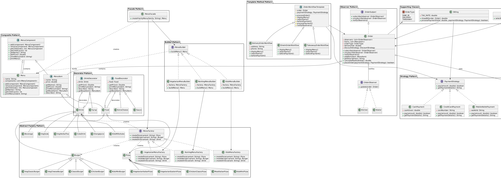

# Restaurant Ordering & Billing System

A comprehensive restaurant management system built with Java, demonstrating advanced software engineering principles, design patterns, and SOLID principles.



## 📋 Table of Contents
- [Overview](#overview)
- [Features](#features)
- [Design Patterns](#design-patterns)
- [Architecture](#architecture)
- [Getting Started](#getting-started)
- [Usage Guide](#usage-guide)
- [Test Cases](#test-cases)
- [Project Structure](#project-structure)
- [Contributing](#contributing)
- [Authors](#authors)
- [License](#license)

## 🎯 Overview

This system is a modular, extensible, and maintainable restaurant ordering solution designed for CS352 - Advanced Software Engineering at Cairo University. It demonstrates the practical application of 9 design patterns and adheres to all SOLID principles.

### Key Capabilities
- **Multiple Menu Families**: Vegetarian, Non-Vegetarian, and Kids menus
- **Dynamic Customization**: Add-ons for items (cheese, sauce, syrup)
- **Flexible Order Types**: Dine-in, Delivery, and Takeaway
- **Multiple Payment Methods**: Cash, Credit Card, and Mobile Wallet
- **Smart Discount System**: Automatic selection of the best discount
- **Real-time Notifications**: Kitchen and Waiter instant updates
- **Automatic Calculations**: 14% tax and delivery fees

## ✨ Features

### Menu Management
- **Hierarchical Menu Structure**: Families → Categories → Items
- **Three Menu Families**:
  - Vegetarian (Italian Pizza, Eastern Pizza, Classic Burger, etc.)
  - Non-Vegetarian (Chicken Pizza, Meat Pizza, Chicken Burger, etc.)
  - Kids (Mini Pizza, Mini Burger, Milkshake)

### Customization
- **Add-ons**:
  - Extra Cheese: 10.00 EGP
  - Sauce: 5.00 EGP
  - Syrup: 7.00 EGP (for drinks)

### Order Processing
- **Dine-in**: Standard in-restaurant service
- **Delivery**: Includes 20 EGP delivery fee + address and phone collection
- **Takeaway**: Quick pickup service

### Payment & Billing
- **Payment Methods**:
  - Cash (with change calculation)
  - Credit Card (16-digit validation)
  - Mobile Wallet (email/ID validation)
- **Automatic Discount Selection**: System chooses the best discount
  - Pizza Discount: 10% off base pizza price
  - Burger Discount: 15% off base burger price
- **Tax Calculation**: Automatic 14% tax on all orders

### Notifications
- Real-time order updates to Kitchen and Waiter staff
- Observer pattern ensures all stakeholders are informed

## 🏗️ Design Patterns

This project implements **9 design patterns** to ensure code quality and maintainability:

### 1. **Composite Pattern** - Menu Structure
- **Purpose**: Treat individual items and menu categories uniformly
- **Implementation**: `MenuComponent`, `Menu`, `MenuItem`
- **Benefit**: Easy menu hierarchy management

### 2. **Decorator Pattern** - Add-ons
- **Purpose**: Dynamically add features to items without modifying classes
- **Implementation**: `FoodDecorator`, `DrinkDecorator`
- **Benefit**: Flexible customization (extra cheese, sauce, syrup)

### 3. **Abstract Factory Pattern** - Menu Families
- **Purpose**: Create consistent product families
- **Implementation**: `MenuFactory` with `VegetarianMenuFactory`, `NonVegMenuFactory`, `KidsMenuFactory`
- **Benefit**: Ensures menu consistency within each family

### 4. **Builder Pattern** - Menu Assembly
- **Purpose**: Construct complex menus step-by-step
- **Implementation**: `MenuBuilder` interface with concrete builders
- **Benefit**: Separation of menu creation logic

### 5. **Facade Pattern** - Simplified Interface
- **Purpose**: Hide system complexity from clients
- **Implementation**: `MenuFacade`
- **Benefit**: Simple menu creation interface

### 6. **Strategy Pattern** - Payment Methods
- **Purpose**: Interchangeable payment algorithms
- **Implementation**: `PaymentStrategy` with multiple implementations
- **Benefit**: Easy addition of new payment methods

### 7. **Strategy Pattern** - Discount Policies
- **Purpose**: Flexible discount application
- **Implementation**: `DiscountStrategy` with `NoDiscount`, `PizzaDiscount`, `BurgerDiscount`
- **Benefit**: Dynamic discount selection

### 8. **Observer Pattern** - Notifications
- **Purpose**: Notify multiple parties of order events
- **Implementation**: `OrderSubject` with `Kitchen` and `Waiter` observers
- **Benefit**: Decoupled notification system

### 9. **Template Method Pattern** - Order Workflow
- **Purpose**: Define skeleton of order processing algorithm
- **Implementation**: `OrderWorkflowTemplate` with `DineInOrderWorkflow`, `TakeawayOrderWorkflow`, `DeliveryOrderWorkflow`
- **Benefit**: Consistent order processing with flexible steps

## 🏛️ Architecture

### SOLID Principles

- **S - Single Responsibility**: Each class has one well-defined purpose
- **O - Open/Closed**: Open for extension, closed for modification
- **L - Liskov Substitution**: All implementations are substitutable for their abstractions
- **I - Interface Segregation**: Small, focused interfaces
- **D - Dependency Inversion**: Depend on abstractions, not concretions

### System Components

```
Restaurant System
├── Menu Management (Composite + Factory + Builder)
├── Item Customization (Decorator)
├── Order Processing (Template Method)
├── Payment Processing (Strategy)
├── Discount Management (Strategy)
└── Notification System (Observer)
```

## 🚀 Getting Started

### Prerequisites

- **Java Development Kit (JDK)**: Version 17 or higher
- **IDE** (optional): IntelliJ IDEA, Eclipse, or VS Code
- **Git**: For cloning the repository

### Installation

1. **Clone the repository**
   ```bash
   git clone https://github.com/yourusername/restaurant-ordering-system.git
   cd restaurant-ordering-system
   ```

2. **Compile the project**
   ```bash
   javac src/RestaurantSystem.java
   ```

3. **Run the application**
   ```bash
   java -cp src RestaurantSystem
   ```

### Using an IDE

1. Open the project in your IDE
2. Locate `RestaurantSystem.java` in the `src` folder
3. Right-click and select "Run"

## 📖 Usage Guide

### Step-by-Step Order Process

1. **Select Menu Family** (1-3)
   - 1: Vegetarian
   - 2: Non-Vegetarian
   - 3: Kids

2. **Add Items to Order**
   - Choose item type (Pizza/Burger/Drink)
   - Select specific items
   - Add optional add-ons
   - Press 0 to finish

3. **Select Order Type** (1-3)
   - 1: Dine-in
   - 2: Delivery (requires address and phone)
   - 3: Takeaway

4. **Choose Payment Method** (1-3)
   - 1: Cash
   - 2: Credit Card
   - 3: Mobile Wallet

5. **Complete Payment**
   - Review bill with all charges
   - Complete payment
   - Receive confirmation

### Example Session

```
Welcome to Restaurant System!
Select Menu Family:
1. Vegetarian
2. Non-Veg
3. Kids
Choice: 1

[Menu displays...]

Select item type (1=Pizza, 2=Burger, 3=Drink): 1
Select Pizza: 1
Add extra cheese? (y/n): y
Add sauce? (y/n): n

Add more items? (0 to finish): 0

Select Order Type:
1. Dine-in
2. Delivery
3. Takeaway
Choice: 1

Select Payment Method:
1. Cash
2. Credit Card
3. Mobile Wallet
Choice: 1

[Bill displays with automatic discount selection]
Total: 20.12 EGP
```

## 🧪 Test Cases

### Test Case 1: Vegetarian Dine-In with Pizza Discount

**Input:**
- Menu: Vegetarian
- Item: Italian Pizza + Extra Cheese
- Order Type: Dine-in
- Payment: Cash (50 EGP)

**Expected Output:**
```
Subtotal: 18.50 EGP
Discount: -0.85 EGP (10% Pizza Discount)
Tax: +2.47 EGP
Total: 20.12 EGP
Change: 29.88 EGP
```

### Test Case 2: Non-Veg Delivery with Burger Discount

**Input:**
- Menu: Non-Vegetarian
- Items: Classic Burger (+ cheese + sauce) + Chicken Pizza
- Order Type: Delivery
- Payment: Credit Card

**Expected Output:**
```
Subtotal: 31.75 EGP
Discount: -0.26 EGP (15% Burger Discount)
Delivery Fee: +20.00 EGP
Tax: +7.21 EGP
Total: 58.70 EGP
```

### Test Case 3: Kids Menu with No Discount

**Input:**
- Menu: Kids
- Items: Milkshake (+ syrup) + Mini Burger
- Order Type: Takeaway
- Payment: Mobile Wallet

**Expected Output:**
```
Subtotal: 10.50 EGP
Discount: 0.00 EGP (No Discount)
Tax: +1.47 EGP
Total: 11.97 EGP
```

See [Test Cases Documentation](docs/TEST_CASES.md) for more detailed test scenarios.

## 📁 Project Structure

```
restaurant-ordering-system/
├── src/
│   └── RestaurantSystem.java      # Main application file
├── docs/
│   ├── UMLdiagram.png             # System UML diagram
│   ├── DocumentFile.pdf           # Design patterns documentation
│   └── TEST_CASES.md              # Detailed test cases
├── README.md                       # This file
├── LICENSE                         # License information
└── .gitignore                      # Git ignore rules
```

### Code Organization

The `RestaurantSystem.java` file contains all classes organized by pattern:

- **Composite Pattern**: `MenuComponent`, `Menu`, `MenuItem`
- **Decorator Pattern**: `FoodDecorator`, `DrinkDecorator`, decorators
- **Factory Pattern**: `MenuFactory`, concrete factories
- **Builder Pattern**: `MenuBuilder`, concrete builders
- **Facade Pattern**: `MenuFacade`
- **Strategy Pattern**: `PaymentStrategy`, `DiscountStrategy` implementations
- **Observer Pattern**: `OrderSubject`, `Kitchen`, `Waiter`
- **Template Method**: `OrderWorkflowTemplate`, workflow implementations
- **Main Class**: `RestaurantSystem` with main method

## 💰 Pricing

### Menu Items

**Vegetarian:**
- Italian Pizza: 170 EGP
- Eastern Pizza: 150 EGP
- Classic Burger: 80.75 EGP
- Cheeseburger: 90.00 EGP

**Non-Vegetarian:**
- Chicken Pizza: 190 EGP
- Meat Pizza: 200 EGP
- Classic Burger: 90 EGP
- Chicken Burger: 100.50 EGP

**Kids:**
- Mini Pizza: 65.50 EGP
- Mini Burger: 50.00 EGP
- Milkshake: 60.00 EGP

**Additional Charges:**
- Tax: 14%
- Delivery Fee: 20.00 EGP

## 🤝 Contributing

Contributions are welcome! Please feel free to submit a Pull Request.

1. Fork the project
2. Create your feature branch (`git checkout -b feature/AmazingFeature`)
3. Commit your changes (`git commit -m 'Add some AmazingFeature'`)
4. Push to the branch (`git push origin feature/AmazingFeature`)
5. Open a Pull Request

## 👥 Authors

- **Roaa Mohammed** - ID: 20230142
- **Mennat-Allah Abdallah** - ID: 20231178

**Course**: CS352 - Advanced Software Engineering  
**Instructor**: Dr. Manar Elkady  
**Institution**: Faculty of Computers and Artificial Intelligence, Cairo University  
**Date**: November 2025

## 📄 License

This project is licensed under the MIT License - see the [LICENSE](LICENSE) file for details.

## 🙏 Acknowledgments

- Dr. Manar Elkady for guidance and instruction
- Cairo University Faculty of Computers and Artificial Intelligence
- Design Patterns: Elements of Reusable Object-Oriented Software (Gang of Four)

## 📞 Contact

For questions or feedback, please contact:
- GitHub: [@yourusername](https://github.com/yourusername)
- Project Link: [https://github.com/yourusername/restaurant-ordering-system](https://github.com/yourusername/restaurant-ordering-system)

---

**Note**: This project is for educational purposes as part of the CS352 course at Cairo University.
